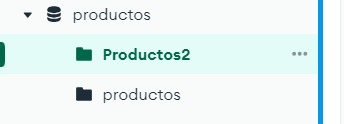

# Actividad de Evaluación. Practica de Agregaciones

## Consultas:

### 1. Cuenta los productos de tipo “medio”, usando un método básico

```javascript
[
  {
    $match:
      /**
       * query: The query in MQL.
       */
      {
        tipo: "medio",
      },
  },
  {
    $count:
      /**
       * Provide the field name for the count.
       */
      "Documentos con tipo medio",
  },
]
```

`Salida:`

```javascript
{
  "Documentos con tipo medio": 25
}
```

### 2. Indicar con un distinct, las empresas (fabricantes) que hay en la colección

```javascript
[
  {
    $group:
      /**
       * _id: The id of the group.
       * fieldN: The first field name.
       */
      {
        _id: null,
        fabricantes: {
          $addToSet: "$fabricante",
        },
      },
  },
]
```

`Salida:`

```javascript
{
  "_id": null,
  "fabricantes": [
    "Nordstrom",
    "State Farm Insurance Cos.",
    "AutoNation",
    "Mondelez International",
    "Universal American",
    "Core-Mark Holding",
    "Precision Castparts",
    "National Oilwell Varco",
    "Best Buy",
    "Lennar",
    "Archrock",
    "Wendy's",
    "WGL Holdings",
    "HealthSouth",
    "Motorola Solutions",
    "Simon Property Group",
    "Ascena Retail Group",
    "Darling Ingredients",
    "Kar Auction Services",
    "Hartford Financial Services Group",
    "HCA Holdings",
    "Kimberly-Clark",
    "Telephone & Data Systems",
    "Seaboard",
    "Comcast",
    "Mercury General",
    "TransDigm Group",
    "OneMain Holdings",
    "Total System Services",
    "Tractor Supply",
    "Hanesbrands",
    "Nasdaq OMX Group",
    "Pep Boys-Mann",
    "Delta Air Lines",
    "Securian Financial Group",
    "A.O. Smith",
    "Werner Enterprises",
    "Universal Health Services",
    "DST Systems",
    "Comerica",
    "Anthem",
    "Hawaiian Holdings",
    "First Solar",
    "TrueBlue",
    "Dick's Sporting Goods",
    "TEGNA",
    "State Street Corp.",
    "Oneok",
    "Alere",
    "Delta Tucker Holdings",
    "American Tire Distributors Holdings",
    "Orbital ATK",
    "Pool",
    "CIT Group",
    "Raymond James Financial",
    "Kelly Services",
    "Williams-Sonoma",
    "Primoris Services",
    "Trinity Industries",
    "Kemper",
    "WestRock",
    "Cabot",
    "Hyatt Hotels",
    "SunPower"
  ]
}
```

### 3. Usando aggregate, visualizar los productos que tengan más de 80 unidades

```javascript
[
  {
    $match:
      /**
       * query: The query in MQL.
       */
      {
        unidades: {
          $gt: 80,
        },
      },
  },
]
```

`Salida:`

```javascript
Sample of 9 documents
{
  "_id": {
    "$oid": "6614956a009452ff39f59896"
  },
  "codigo": 0,
  "nombre": "Fantastic Wooden Fish",
  "unidades": 95,
  "precio": 291,
  "fabricante": "Kimberly-Clark",
  "tipo": "avanzado"
}

{
  "_id": {
    "$oid": "6614956a009452ff39f59898"
  },
  "codigo": 2,
  "nombre": "Small Soft Fish",
  "unidades": 96,
  "precio": 189,
  "fabricante": "Primoris Services",
  "tipo": "medio"
}

{
  "_id": {
    "$oid": "6614956a009452ff39f598a2"
  },
  "codigo": 12,
  "nombre": "Refined Concrete Salad",
  "unidades": 90,
  "precio": 129,
  "fabricante": "Universal Health Services",
  "tipo": "avanzado"
}

{
  "_id": {
    "$oid": "6614956a009452ff39f598b4"
  },
  "codigo": 30,
  "nombre": "Small Rubber Pants",
  "unidades": 89,
  "precio": 16,
  "fabricante": "Hanesbrands",
  "tipo": "basico"
}

{
  "_id": {
    "$oid": "6614956a009452ff39f598b7"
  },
  "codigo": 33,
  "nombre": "Generic Concrete Hat",
  "unidades": 82,
  "precio": 70,
  "fabricante": "American Tire Distributors Holdings",
  "tipo": "basico"
}

{
  "_id": {
    "$oid": "6614956a009452ff39f598cb"
  },
  "codigo": 53,
  "nombre": "Licensed Plastic Hat",
  "unidades": 96,
  "precio": 38,
  "fabricante": "Best Buy",
  "tipo": "medio"
}

{
  "_id": {
    "$oid": "6614956a009452ff39f598cc"
  },
  "codigo": 54,
  "nombre": "Generic Metal Sausages",
  "unidades": 84,
  "precio": 77,
  "fabricante": "DST Systems",
  "tipo": "medio"
}

{
  "_id": {
    "$oid": "6614956a009452ff39f598d3"
  },
  "codigo": 61,
  "nombre": "Sleek Rubber Keyboard",
  "unidades": 82,
  "precio": 33,
  "fabricante": "Alere",
  "tipo": "basico"
}

{
  "_id": {
    "$oid": "6614956a009452ff39f598d8"
  },
  "codigo": 66,
  "nombre": "Incredible Concrete Fish",
  "unidades": 96,
  "precio": 336,
  "fabricante": "Darling Ingredients",
  "tipo": "medio"
}
```

### 4. Con $project visualizar solo el nombre, unidades y precio de los productos que tengan menos de 10 unidades

```javascript
[
  {
    $match:
      /**
       * query: The query in MQL.
       */
      {
        unidades: {
          $lt: 10,
        },
      },
  },
  {
    $project:
      /**
       * specifications: The fields to
       *   include or exclude.
       */
      {
        _id: 0,
        nombre: 1,
        unidades: 1,
        precio: 1,
      },
  },
]
```

`Salida:`

```javascript
Sample of 7 documents

{
  "nombre": "Ergonomic Metal Ball",
  "unidades": 5,
  "precio": 246
}

{
  "nombre": "Handmade Plastic Hat",
  "unidades": 7,
  "precio": 253
}

{
  "nombre": "Ergonomic Metal Table",
  "unidades": 0,
  "precio": 94
}

{
  "nombre": "Practical Frozen Chips",
  "unidades": 0,
  "precio": 305
}

{
  "nombre": "Fantastic Metal Pants",
  "unidades": 5,
  "precio": 129
}

{
  "nombre": "Intelligent Frozen Sausages",
  "unidades": 3,
  "precio": 111
}

{
  "nombre": "Rustic Plastic Mouse",
  "unidades": 5,
  "precio": 24
}
```

### 5. Con $project ponemos el fabricante, pero le cambiamos el nombre por “empresa”. Usamos el mismo comando anterior

```javascript
[
  {
    $match:
      /**
       * query: The query in MQL.
       */
      {
        unidades: {
          $lt: 10,
        },
      },
  },
  {
    $project:
      /**
       * specifications: The fields to
       *   include or exclude.
       */
      {
        _id: 0,
        nombre: 1,
        unidades: 1,
        precio: 1,
        empresa: "$fabricante",
      },
  },
]
```

`Salida:`

```javascript
Sample of 7 documents

{
  "nombre": "Ergonomic Metal Ball",
  "unidades": 5,
  "precio": 246,
  "empresa": "Seaboard"
}

{
  "nombre": "Handmade Plastic Hat",
  "unidades": 7,
  "precio": 253,
  "empresa": "Dick's Sporting Goods"
}

{
  "nombre": "Ergonomic Metal Table",
  "unidades": 0,
  "precio": 94,
  "empresa": "Kelly Services"
}

{
  "nombre": "Practical Frozen Chips",
  "unidades": 0,
  "precio": 305,
  "empresa": "Delta Air Lines"
}

{
  "nombre": "Fantastic Metal Pants",
  "unidades": 5,
  "precio": 129,
  "empresa": "OneMain Holdings"
}

{
  "nombre": "Intelligent Frozen Sausages",
  "unidades": 3,
  "precio": 111,
  "empresa": "A.O. Smith"
}

{
  "nombre": "Rustic Plastic Mouse",
  "unidades": 5,
  "precio": 24,
  "empresa": "Orbital ATK"
}
```

### 6. Añadir a la consulta anterior un campo calculado que se llame total y que multiplique precio por unidades.

```javascript
[
  {
    $match:
      /**
       * query: The query in MQL.
       */
      {
        unidades: {
          $lt: 10,
        },
      },
  },
  {
    $project:
      /**
       * specifications: The fields to
       *   include or exclude.
       */
      {
        _id: 0,
        nombre: 1,
        unidades: 1,
        precio: 1,
        empresa: "$fabricante",
      },
  },
  {
    $addFields:
      /**
       * newField: The new field name.
       * expression: The new field expression.
       */
      {
        total: {
          $multiply: ["$precio", "$unidades"],
        },
      },
  },
]
```

`Salida:`

```javascript
Sample of 7 documents

{
  "nombre": "Ergonomic Metal Ball",
  "unidades": 5,
  "precio": 246,
  "empresa": "Seaboard",
  "total": 1230
}

{
  "nombre": "Handmade Plastic Hat",
  "unidades": 7,
  "precio": 253,
  "empresa": "Dick's Sporting Goods",
  "total": 1771
}

{
  "nombre": "Ergonomic Metal Table",
  "unidades": 0,
  "precio": 94,
  "empresa": "Kelly Services",
  "total": 0
}

{
  "nombre": "Practical Frozen Chips",
  "unidades": 0,
  "precio": 305,
  "empresa": "Delta Air Lines",
  "total": 0
}

{
  "nombre": "Fantastic Metal Pants",
  "unidades": 5,
  "precio": 129,
  "empresa": "OneMain Holdings",
  "total": 645
}

{
  "nombre": "Intelligent Frozen Sausages",
  "unidades": 3,
  "precio": 111,
  "empresa": "A.O. Smith",
  "total": 333
}

{
  "nombre": "Rustic Plastic Mouse",
  "unidades": 5,
  "precio": 24,
  "empresa": "Orbital ATK",
  "total": 120
}
```

### 7. Hacer que el nombre salga en mayúsculas con el operador $toUpper

```javascript
[
  {
    $match:
      /**
       * query: The query in MQL.
       */
      {
        unidades: {
          $lt: 10,
        },
      },
  },
  {
    $project:
      /**
       * specifications: The fields to
       *   include or exclude.
       */
      {
        _id: 0,
        nombre: 1,
        unidades: 1,
        precio: 1,
        empresa: "$fabricante",
      },
  },
  {
    $addFields:
      /**
       * newField: The new field name.
       * expression: The new field expression.
       */
      {
        total: {
          $multiply: ["$precio", "$unidades"],
        },
      },
  },
  {
    $addFields:
      /**
       * newField: The new field name.
       * expression: The new field expression.
       */
      {
        mayusculas: {
          $toUpper: "$nombre",
        },
      },
  },
]
```

`Salida:`

```javascript
Sample of 7 documents

{
  "nombre": "Ergonomic Metal Ball",
  "unidades": 5,
  "precio": 246,
  "empresa": "Seaboard",
  "total": 1230,
  "mayusculas": "ERGONOMIC METAL BALL"
}

{
  "nombre": "Handmade Plastic Hat",
  "unidades": 7,
  "precio": 253,
  "empresa": "Dick's Sporting Goods",
  "total": 1771,
  "mayusculas": "HANDMADE PLASTIC HAT"
}

{
  "nombre": "Ergonomic Metal Table",
  "unidades": 0,
  "precio": 94,
  "empresa": "Kelly Services",
  "total": 0,
  "mayusculas": "ERGONOMIC METAL TABLE"
}

{
  "nombre": "Practical Frozen Chips",
  "unidades": 0,
  "precio": 305,
  "empresa": "Delta Air Lines",
  "total": 0,
  "mayusculas": "PRACTICAL FROZEN CHIPS"
}

{
  "nombre": "Fantastic Metal Pants",
  "unidades": 5,
  "precio": 129,
  "empresa": "OneMain Holdings",
  "total": 645,
  "mayusculas": "FANTASTIC METAL PANTS"
}

{
  "nombre": "Intelligent Frozen Sausages",
  "unidades": 3,
  "precio": 111,
  "empresa": "A.O. Smith",
  "total": 333,
  "mayusculas": "INTELLIGENT FROZEN SAUSAGES"
}

{
  "nombre": "Rustic Plastic Mouse",
  "unidades": 5,
  "precio": 24,
  "empresa": "Orbital ATK",
  "total": 120,
  "mayusculas": "RUSTIC PLASTIC MOUSE"
}
```

### 8. Añadir un campo calculado que ponga el nombre del producto y el tipo concatenado con el operador $concat. Le llamamos al campo “completo”

```javascript
[
  {
    $match:
      /**
       * query: The query in MQL.
       */
      {
        unidades: {
          $lt: 10,
        },
      },
  },
  {
    $project:
      /**
       * specifications: The fields to
       *   include or exclude.
       */
      {
        _id: 0,
        nombre: 1,
        unidades: 1,
        precio: 1,
        empresa: "$fabricante",
        tipo: "$tipo",
      },
  },
  {
    $addFields:
      /**
       * newField: The new field name.
       * expression: The new field expression.
       */
      {
        total: {
          $multiply: ["$precio", "$unidades"],
        },
      },
  },
  {
    $addFields:
      /**
       * newField: The new field name.
       * expression: The new field expression.
       */
      {
        mayusculas: {
          $toUpper: "$nombre",
        },
      },
  },
  {
    $addFields:
      /**
       * newField: The new field name.
       * expression: The new field expression.
       */
      {
        completo: {
          $concat: [
            "$nombre",
            " de tipo ",
            "$tipo",
          ],
        },
      },
  },
]
```

`Salida:`

```javascript
Sample of 7 documents

{
  "nombre": "Ergonomic Metal Ball",
  "unidades": 5,
  "precio": 246,
  "empresa": "Seaboard",
  "tipo": "medio",
  "total": 1230,
  "mayusculas": "ERGONOMIC METAL BALL",
  "completo": "Ergonomic Metal Ball de tipo medio"
}

{
  "nombre": "Handmade Plastic Hat",
  "unidades": 7,
  "precio": 253,
  "empresa": "Dick's Sporting Goods",
  "tipo": "medio",
  "total": 1771,
  "mayusculas": "HANDMADE PLASTIC HAT",
  "completo": "Handmade Plastic Hat de tipo medio"
}

{
  "nombre": "Ergonomic Metal Table",
  "unidades": 0,
  "precio": 94,
  "empresa": "Kelly Services",
  "tipo": "avanzado",
  "total": 0,
  "mayusculas": "ERGONOMIC METAL TABLE",
  "completo": "Ergonomic Metal Table de tipo avanzado"
}

{
  "nombre": "Practical Frozen Chips",
  "unidades": 0,
  "precio": 305,
  "empresa": "Delta Air Lines",
  "tipo": "medio",
  "total": 0,
  "mayusculas": "PRACTICAL FROZEN CHIPS",
  "completo": "Practical Frozen Chips de tipo medio"
}

{
  "nombre": "Fantastic Metal Pants",
  "unidades": 5,
  "precio": 129,
  "empresa": "OneMain Holdings",
  "tipo": "basico",
  "total": 645,
  "mayusculas": "FANTASTIC METAL PANTS",
  "completo": "Fantastic Metal Pants de tipo basico"
}

{
  "nombre": "Intelligent Frozen Sausages",
  "unidades": 3,
  "precio": 111,
  "empresa": "A.O. Smith",
  "tipo": "basico",
  "total": 333,
  "mayusculas": "INTELLIGENT FROZEN SAUSAGES",
  "completo": "Intelligent Frozen Sausages de tipo basico"
}

{
  "nombre": "Rustic Plastic Mouse",
  "unidades": 5,
  "precio": 24,
  "empresa": "Orbital ATK",
  "tipo": "avanzado",
  "total": 120,
  "mayusculas": "RUSTIC PLASTIC MOUSE",
  "completo": "Rustic Plastic Mouse de tipo avanzado"
}
```

### 9. Ordena el resultado por el campo “total”

```javascript
[
  {
    $match:
      /**
       * query: The query in MQL.
       */
      {
        unidades: {
          $lt: 10,
        },
      },
  },
  {
    $project:
      /**
       * specifications: The fields to
       *   include or exclude.
       */
      {
        _id: 0,
        nombre: 1,
        unidades: 1,
        precio: 1,
        empresa: "$fabricante",
        tipo: "$tipo",
      },
  },
  {
    $addFields:
      /**
       * newField: The new field name.
       * expression: The new field expression.
       */
      {
        total: {
          $multiply: ["$precio", "$unidades"],
        },
      },
  },
  {
    $addFields:
      /**
       * newField: The new field name.
       * expression: The new field expression.
       */
      {
        mayusculas: {
          $toUpper: "$nombre",
        },
      },
  },
  {
    $addFields:
      /**
       * newField: The new field name.
       * expression: The new field expression.
       */
      {
        completo: {
          $concat: [
            "$nombre",
            " de tipo ",
            "$tipo",
          ],
        },
      },
  },
  {
    $sort:
      /**
       * Provide any number of field/order pairs.
       */
      {
        total: 1,
      },
  },
]
```

`Salida:`

```javascript
Sample of 7 documents

{
  "nombre": "Ergonomic Metal Table",
  "unidades": 0,
  "precio": 94,
  "tipo": "avanzado",
  "empresa": "Kelly Services",
  "total": 0,
  "mayusculas": "ERGONOMIC METAL TABLE",
  "completo": "Ergonomic Metal Table de tipo avanzado"
}

{
  "nombre": "Practical Frozen Chips",
  "unidades": 0,
  "precio": 305,
  "tipo": "medio",
  "empresa": "Delta Air Lines",
  "total": 0,
  "mayusculas": "PRACTICAL FROZEN CHIPS",
  "completo": "Practical Frozen Chips de tipo medio"
}

{
  "nombre": "Rustic Plastic Mouse",
  "unidades": 5,
  "precio": 24,
  "tipo": "avanzado",
  "empresa": "Orbital ATK",
  "total": 120,
  "mayusculas": "RUSTIC PLASTIC MOUSE",
  "completo": "Rustic Plastic Mouse de tipo avanzado"
}

{
  "nombre": "Intelligent Frozen Sausages",
  "unidades": 3,
  "precio": 111,
  "tipo": "basico",
  "empresa": "A.O. Smith",
  "total": 333,
  "mayusculas": "INTELLIGENT FROZEN SAUSAGES",
  "completo": "Intelligent Frozen Sausages de tipo basico"
}

{
  "nombre": "Fantastic Metal Pants",
  "unidades": 5,
  "precio": 129,
  "tipo": "basico",
  "empresa": "OneMain Holdings",
  "total": 645,
  "mayusculas": "FANTASTIC METAL PANTS",
  "completo": "Fantastic Metal Pants de tipo basico"
}

{
  "nombre": "Ergonomic Metal Ball",
  "unidades": 5,
  "precio": 246,
  "tipo": "medio",
  "empresa": "Seaboard",
  "total": 1230,
  "mayusculas": "ERGONOMIC METAL BALL",
  "completo": "Ergonomic Metal Ball de tipo medio"
}

{
  "nombre": "Handmade Plastic Hat",
  "unidades": 7,
  "precio": 253,
  "tipo": "medio",
  "empresa": "Dick's Sporting Goods",
  "total": 1771,
  "mayusculas": "HANDMADE PLASTIC HAT",
  "completo": "Handmade Plastic Hat de tipo medio"
}
```

### 10. Haciendo una nueva consulta, averiguar el numero de productos por tipo de producto

```javascript
[
  {
    $group:
      /**
       * _id: The id of the group.
       * fieldN: The first field name.
       */
      {
        _id: "$tipo",
        count: {
          $sum: 1,
        },
      },
  },
]
```

`Salida:`

```javascript
{
  "_id": "basico",
  "count": 24
}

{
  "_id": "avanzado",
  "count": 18
}

{
  "_id": "medio",
  "count": 25
}
```

### 11. Añadir el valor mayor y el menor

```javascript
[
  {
    $group:
      /**
       * _id: The id of the group.
       * fieldN: The first field name.
       */
      {
        _id: "$tipo",
        numero_productos: {
          $sum: 1,
        },
        valor_mayor: {
          $max: "$precio",
        },
        valor_menor: {
          $min: "$precio",
        },
      },
  },
]
```

`Salida:`

```javascript
{
  "_id": "basico",
  "numero_productos": 24,
  "valor_mayor": 285,
  "valor_menor": 16
}

{
  "_id": "avanzado",
  "numero_productos": 18,
  "valor_mayor": 331,
  "valor_menor": 18
}

{
  "_id": "medio",
  "numero_productos": 25,
  "valor_mayor": 337,
  "valor_menor": 16
}
```

### 12. Añade el total de unidades por cada tipo

```javascript
[
  {
    $group:
      /**
       * _id: The id of the group.
       * fieldN: The first field name.
       */
      {
        _id: "$tipo",
        numero_productos: {
          $sum: 1,
        },
        valor_mayor: {
          $max: "$precio",
        },
        valor_menor: {
          $min: "$precio",
        },
        total_unidades: {
          $sum: "$unidades",
        },
      },
  },
]
```

`Salida:`

```javascript
{
  "_id": "basico",
  "numero_productos": 24,
  "valor_mayor": 285,
  "valor_menor": 16,
  "total_unidades": 1067
}

{
  "_id": "avanzado",
  "numero_productos": 18,
  "valor_mayor": 331,
  "valor_menor": 18,
  "total_unidades": 773
}

{
  "_id": "medio",
  "numero_productos": 25,
  "valor_mayor": 337,
  "valor_menor": 16,
  "total_unidades": 1224
}
```

### 13. Con el operador $set y el operador “$substr” visualiza todos los datos del producto "Small Metal Tuna" y los primeros 5 caracteres del nombre

```javascript
[
  {
    $match:
      /**
       * query: The query in MQL.
       */
      {
        nombre: "Small Metal Tuna",
      },
  },
  {
    $set:
      /**
       * field: The field name
       * expression: The expression.
       */
      {
        nombre_5_caracteres: {
          $substr: ["$nombre", 0, 5],
        },
      },
  },
]
```

`Salida:`

```javascript
{
  "_id": {
    "$oid": "6614956a009452ff39f598cd"
  },
  "codigo": 55,
  "nombre": "Small Metal Tuna",
  "unidades": 46,
  "precio": 43,
  "fabricante": "Raymond James Financial",
  "tipo": "medio",
  "nombre_5_caracteres": "Small"
}
```

### 14. Creamos una salida que tenga el nombre del articulo y el total (precio por unidades) y lo guardamos en una colección denominada productos2

```javascript
[
  {
    "$group": {
      "_id": "$nombre",
      "total": { "$sum": { "$multiply": ["$precio", "$unidades"] } }
    }
  },
  {
    "$project": {
      "_id": 0,
      "nombre": "$_id",
      "total": 1
    }
  },
  {
    "$out": "productos2"
  }
]
```

`Salida:` En la coleccion llamada productos2

```javascript
{
  "_id": {
    "$oid": "6614c3470a72ec66eefec159"
  },
  "total": 1771,
  "nombre": "Handmade Plastic Hat"
}

{
  "_id": {
    "$oid": "6614c3470a72ec66eefec15a"
  },
  "total": 333,
  "nombre": "Intelligent Frozen Sausages"
}

{
  "_id": {
    "$oid": "6614c3470a72ec66eefec15b"
  },
  "total": 2706,
  "nombre": "Sleek Rubber Keyboard"
}

{
  "_id": {
    "$oid": "6614c3470a72ec66eefec15c"
  },
  "total": 11115,
  "nombre": "Awesome Cotton Mouse"
}

{
  "_id": {
    "$oid": "6614c3470a72ec66eefec15d"
  },
  "total": 2125,
  "nombre": "Ergonomic Metal Hat"
}

{
  "_id": {
    "$oid": "6614c3470a72ec66eefec15e"
  },
  "total": 11648,
  "nombre": "Handmade Soft Chips"
}

{
  "_id": {
    "$oid": "6614c3470a72ec66eefec15f"
  },
  "total": 10750,
  "nombre": "Practical Frozen Salad"
}

{
  "_id": {
    "$oid": "6614c3470a72ec66eefec160"
  },
  "total": 1368,
  "nombre": "Tasty Wooden Ball"
}

{
  "_id": {
    "$oid": "6614c3470a72ec66eefec161"
  },
  "total": 24163,
  "nombre": "Rustic Soft Table"
}

{
  "_id": {
    "$oid": "6614c3470a72ec66eefec162"
  },
  "total": 10023,
  "nombre": "Rustic Steel Shoes"
}

{
  "_id": {
    "$oid": "6614c3470a72ec66eefec163"
  },
  "total": 1978,
  "nombre": "Small Metal Tuna"
}

{
  "_id": {
    "$oid": "6614c3470a72ec66eefec164"
  },
  "total": 8480,
  "nombre": "Refined Wooden Tuna"
}

{
  "_id": {
    "$oid": "6614c3470a72ec66eefec165"
  },
  "total": 6468,
  "nombre": "Generic Metal Sausages"
}

{
  "_id": {
    "$oid": "6614c3470a72ec66eefec166"
  },
  "total": 6157,
  "nombre": "Sleek Steel Chicken"
}

{
  "_id": {
    "$oid": "6614c3470a72ec66eefec167"
  },
  "total": 32256,
  "nombre": "Incredible Concrete Fish"
}

{
  "_id": {
    "$oid": "6614c3470a72ec66eefec168"
  },
  "total": 4512,
  "nombre": "Handcrafted Soft Gloves"
}

{
  "_id": {
    "$oid": "6614c3470a72ec66eefec169"
  },
  "total": 15145,
  "nombre": "Licensed Fresh Chicken"
}

{
  "_id": {
    "$oid": "6614c3470a72ec66eefec16a"
  },
  "total": 5740,
  "nombre": "Generic Concrete Hat"
}

{
  "_id": {
    "$oid": "6614c3470a72ec66eefec16b"
  },
  "total": 2793,
  "nombre": "Refined Concrete Shirt"
}

{
  "_id": {
    "$oid": "6614c3470a72ec66eefec16c"
  },
  "total": 4212,
  "nombre": "Refined Plastic Hat"
}
```

### 15. Creamos una salida que tenga el nombre del articulo y el total (precio por unidades) y lo guardamos en una colección denominada productos2

```
Es lo mismo que lo anterior en el ejercicio numero 14
```

### 16. Comprobamos que se ha creado


### 17. Hacemos un find para comprobar el resultado

```javascript
db.Productos2.find({})
```

`Salida:`

```javascript
Sample of 10 documents

{
  "_id": {
    "$oid": "6614c3470a72ec66eefec159"
  },
  "total": 1771,
  "nombre": "Handmade Plastic Hat"
}

{
  "_id": {
    "$oid": "6614c3470a72ec66eefec15a"
  },
  "total": 333,
  "nombre": "Intelligent Frozen Sausages"
}

{
  "_id": {
    "$oid": "6614c3470a72ec66eefec15b"
  },
  "total": 2706,
  "nombre": "Sleek Rubber Keyboard"
}

{
  "_id": {
    "$oid": "6614c3470a72ec66eefec15c"
  },
  "total": 11115,
  "nombre": "Awesome Cotton Mouse"
}

{
  "_id": {
    "$oid": "6614c3470a72ec66eefec15d"
  },
  "total": 2125,
  "nombre": "Ergonomic Metal Hat"
}

{
  "_id": {
    "$oid": "6614c3470a72ec66eefec15e"
  },
  "total": 11648,
  "nombre": "Handmade Soft Chips"
}

{
  "_id": {
    "$oid": "6614c3470a72ec66eefec15f"
  },
  "total": 10750,
  "nombre": "Practical Frozen Salad"
}

{
  "_id": {
    "$oid": "6614c3470a72ec66eefec160"
  },
  "total": 1368,
  "nombre": "Tasty Wooden Ball"
}

{
  "_id": {
    "$oid": "6614c3470a72ec66eefec161"
  },
  "total": 24163,
  "nombre": "Rustic Soft Table"
}

{
  "_id": {
    "$oid": "6614c3470a72ec66eefec162"
  },
  "total": 10023,
  "nombre": "Rustic Steel Shoes"
}
```

Espero que te sirva :wink: :computer: :100:

Por: Benjamin Peña Marin :sunglasses: :+1: