# Actividad de Evaluación 2. Practica de creación de data warehouse

## implementing Dimensions and fact tables

## Ejercicio 1. Crear una base de datos de almacén de datos y una secuencia

### En esta práctica, implementará un almacén de datos. Utilizará la base de datos de ejemplo AdventureWorksDW2012 como origen de sus datos. No va a crear un área de preparación de datos explícita; va a utilizar la base de datos de muestra AdventureWorksDW2012 como su área de preparación de datos. Si encuentra algún problema al completar un ejercicio, puede instalar los proyectos completos desde la carpeta Solución que se proporciona con el contenido complementario de este capítulo y lección.

EJERCICIO 1 Crear una base de datos de almacén de datos y una secuencia

En el primer ejercicio, creará una base de datos de SQL Server para su almacén de datos.

1. Inicie SSMS y conéctese a su instancia de SQL Server. Abra una nueva ventana de consulta
haciendo clic en el botón Nueva consulta.
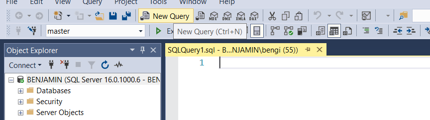

2. Desde el contexto de la base de datos maestra, cree una nueva base de datos llamada
tk463DW. Antes de crear la base de datos, compruebe si existe y suéltela si es necesario.
Siempre debe verificar si existe un objeto y soltarlo si es necesario. 
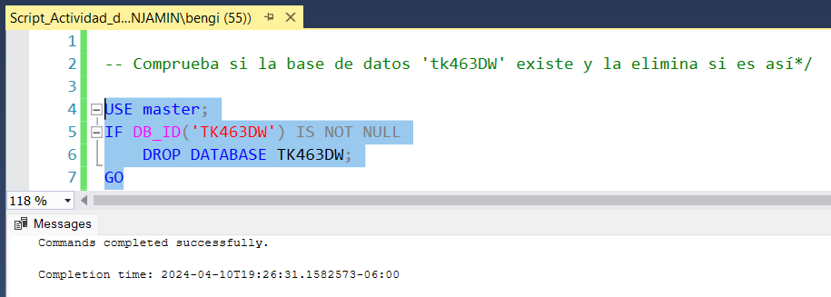

    **La base de datos debe tener las siguientes propiedades:**

*  Debe tener un solo archivo de datos y un solo archivo de registro en la carpeta
TK463. Puede crear esta carpeta en cualquier unidad que desee.

* El archivo de datos debe tener un tamaño inicial de 300 MB y estar habilitado para el crecimiento automático en fragmentos de 10 MB.

* El tamaño del archivo de registro debe ser de 50 MB, con un 10 por ciento de fragmentos de crecimiento automático.

    Creacion de la carpeta en C:
    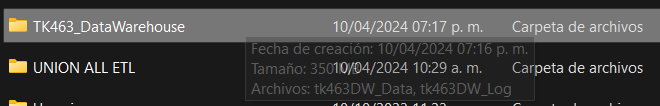

    Script para crear la base de datos:
    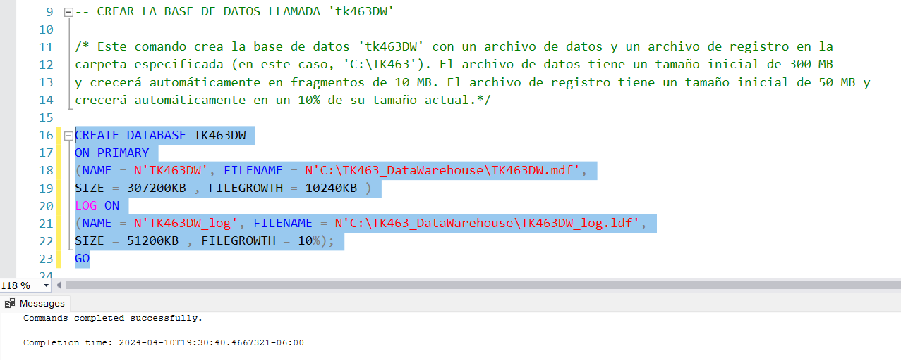

3. Cambiar el modelo de recuperacion a Simple:
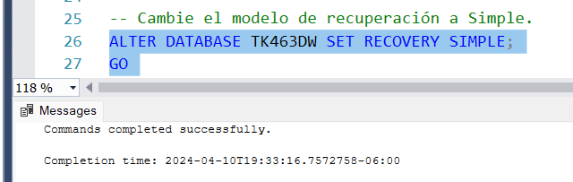

4. En su nuevo almacén de datos, cree un objeto de secuencia. Nómbrelo seqcustomerDwkey. Comience a numerar con 1 y use un incremento de 1. Para otras Practica opciones de secuencia, use los valores predeterminados de SQL Server. 
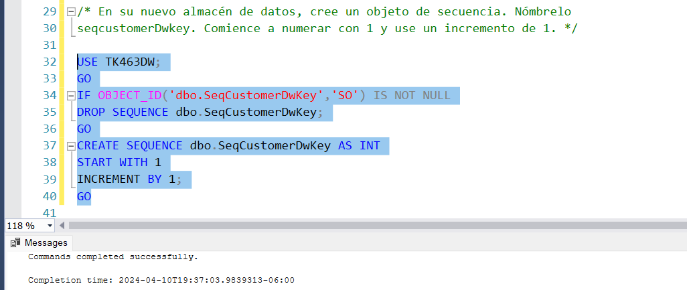

## Ejercicio 2. Creando dimensiones

### En este ejercicio, creará la dimensión Clientes, para lo cual tendrá que implementar muchos de los conocimientos adquiridos en este capítulo y en el anterior. En la base de datos Adventure WorksDW2012, la dimensión DimCustomer, que servirá como fuente para la dimensión Customers, está parcialmente cubierta de nieve. Tiene una tabla de búsqueda de un nivel llamada DimGeography. Desnormalizarás completamente esta dimensión. Además, agregará las columnas necesarias para admitir una dimensión SCD Tipo 2 y un par de columnas calculadas. Además de la dimensión Clientes, creará las dimensiones Productos y Fechas.

1. Crear la Dimensión Customers. El origen de esta dimensión es la dimensión DimCustomer
de la base de datos de ejemplo AdventureWorksDW2012. Agregue una columna de clave
sustituta llamada customerDwkey y cree una restricción de clave principal en esta
columna. Utilice la Tabla 2-1 para obtener la información necesaria para definir las
columnas de la tabla y para completar la tabla.
Para las columnas en las que la columna de comentarios de la tabla 2-1 esté vacía, complete la
columna con valores de una columna con el mismo nombre en la dimensión de origen de
adventureWorksDW2012 (en este caso, DimCustomer); cuando la columna de comentarios no
está vacía, puede encontrar información sobre cómo llenar los valores de columna de una
columna con un nombre diferente en la dimensión de origen de adventureWorksDW2012, o con
una columna de una tabla relacionada, con una restricción predeterminada o con una expresión .
Completará todas las dimensiones en la práctica de la Lección 2 de este capítulo.

2. Crear la dimensión Clientes
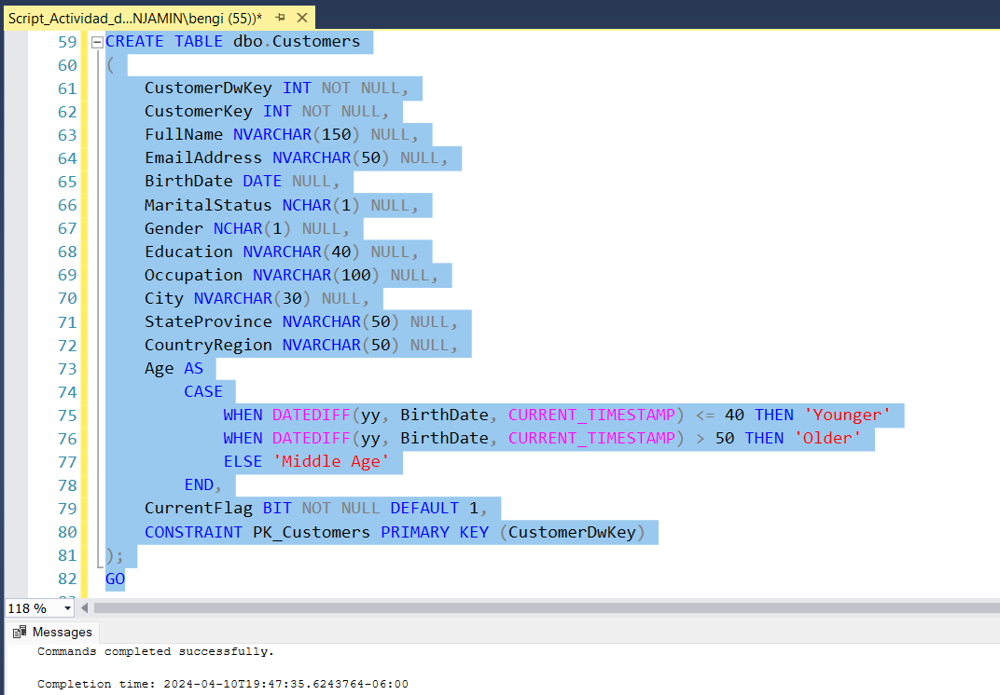

3. Cree la dimensión Productos y Cree la dimensión Fechas.
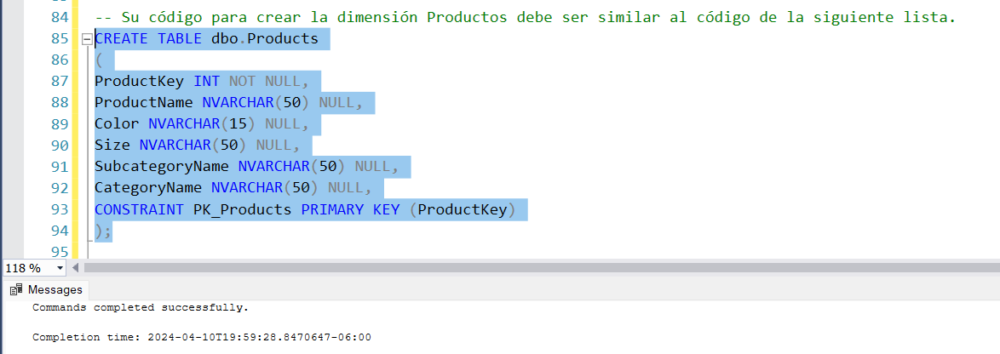
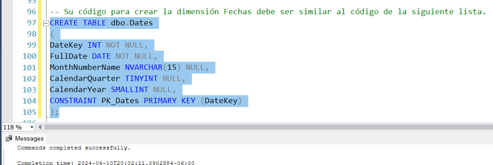

## Ejercicio 3. Crear una tabla de hechos

### En este ejemplo simplificado de un almacén de datos real, creará una única tabla de hechos. En este ejemplo, no puede usar todas las claves externas juntas como una clave principal compuesta, porque el origen de esta tabla, la tabla FactInternatSales de la base de datos AdventureWorksDW2012, tiene una granularidad más baja que la tabla de hechos que está creando, y la clave principal se duplicaría. Puede utilizar las columnas SalesOrderNumber y SalesOrderLineNumber como clave principal, como en una tabla de origen; sin embargo, para mostrar cómo puede autonumerar una columna con la propiedad IDENTIDAD, este ejercicio le pide que agregue su propia columna de enteros con esta propiedad. Esta será su clave sustituta.

1. Cree la tabla de hechos InternetSales.
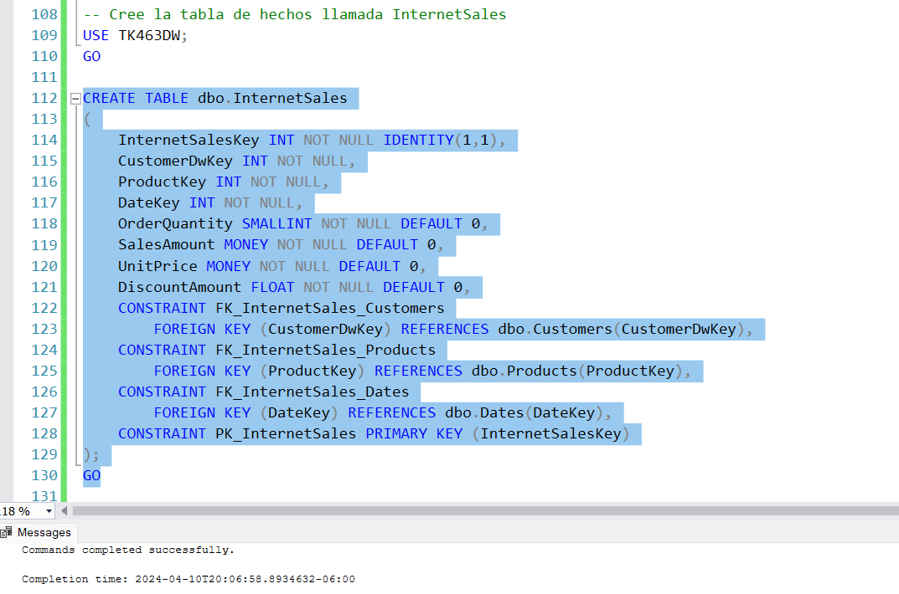

2. Modifique la tabla de hechos InternetSales para agregar restricciones de clave externa para
las relaciones con las tres dimensiones. 
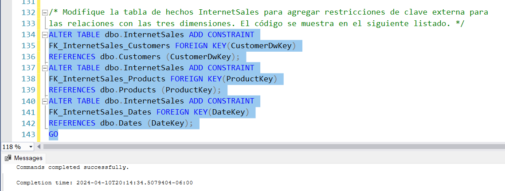

3. Cree un diagrama de base de datos, como se muestra en la Figura 2-1. Nómbrelo internetsalesDW y guárdelo.
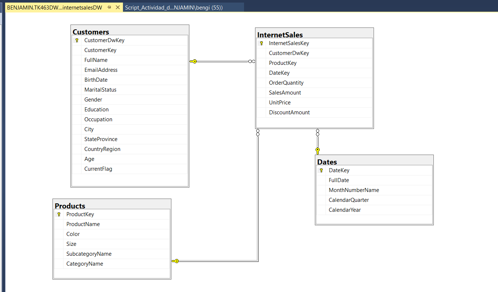

